# RATIS-Fusion-stark-

**Cerveau topologique RATIS × Système nerveux Needle — agent cognitif symbiotique, souverain et certifié.**

> Propriété intellectuelle : **JOHNKING0 & Jonathan Evina** · ORCID [0009-0000-4092-5313](https://orcid.org/0009-0000-4092-5313) · DOI [10.17605/OSF.IO/6JZMB](https://doi.org/10.17605/OSF.IO/6JZMB)
>
**La loi LCT (R = P_sig, ΔW = η·φ·P_sig·C) est FIGÉE. Elle gouverne la cognition, jamais modifiée.**

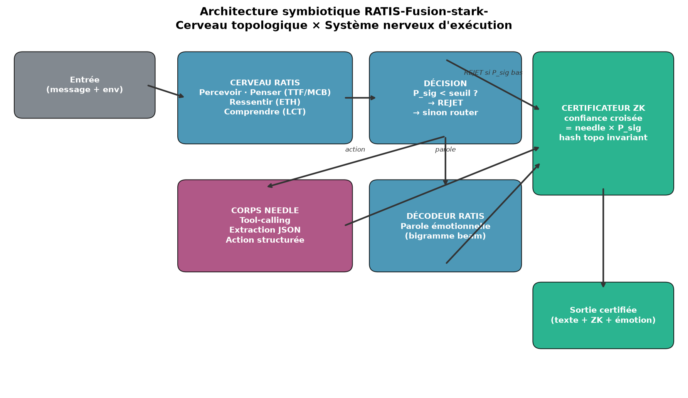

---

## Qu'est-ce que RATIS-Fusion-stark- ?

Ce dépôt réalise la **symbiose** de deux systèmes complémentaires :

| | **RATIS (cerveau)** | **Needle (corps)** |
|---|---|---|
| **Rôle** | Cognition : percevoir, penser, ressentir, comprendre, certifier | Exécution : tool-calling, extraction JSON |
| **Apprentissage** | Loi physique LCT (figée), pas de gradient | Réseau d'attention (LoRA) |
| **Souveraineté** | 100% local (NumPy + GUDHI) | 100% local (moteur 14 Mo pré-cachable) |
| **Certification** | Hash topologique invariant (ZK) | Score de confiance calibré |

**Le pont cognitif** fait que RATIS décide **pourquoi / quand / est-ce vrai**, et Needle exécute **comment**. La règle fondamentale :

> **Si la cohérence topologique P_sig s'effondre, le système se tait.**
> `confiance_certifiée = confiance_needle × P_sig`

---

## Architecture

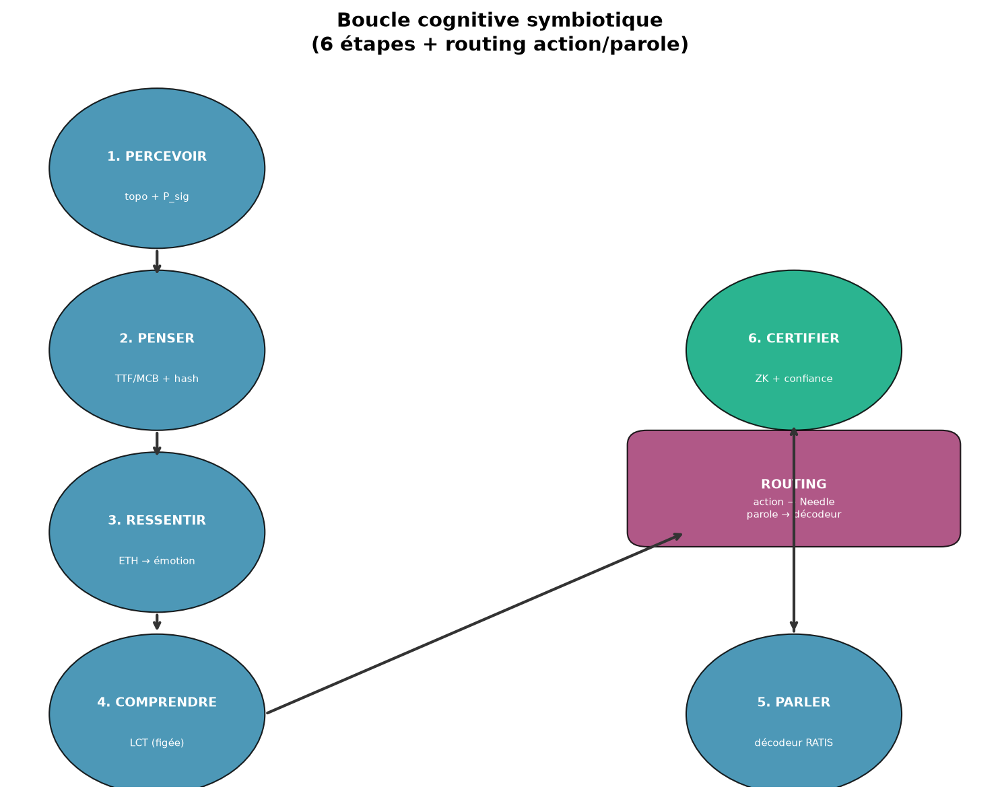

La boucle cognitive symbiotique (6 étapes + routing) :

1. **PERCEVOIR** — tokeniser → embeddings topologiques (TTF/MCB) + cohérence P_sig
2. **PENSER** — cerveau TTF-Compute oscille → MCB (pensée sans mots) + hash topo
3. **RESSENTIR** — ETH prédit C_seuil = f(message, env) → émotion émergente
4. **COMPRENDRE** — réseau LCT classifie (message, env) → émotion dominante
5. **PARLER / AGIR** — routing : action (Needle tool-call) ou parole (décodeur RATIS)
6. **CERTIFIER** — confiance croisée + hash topo invariant → preuve ZK

---

## Résultats validés (honnêtes)

### Dualité des mémoires (thèse de Jonathan Evina)

Il existe deux mémoires fondamentales couplées : la **textuelle** (LLM, retient le mot) et la **logique** (RATIS, retient la forme topologique + émotion + cohérence). Le couplage **est** la cognition.

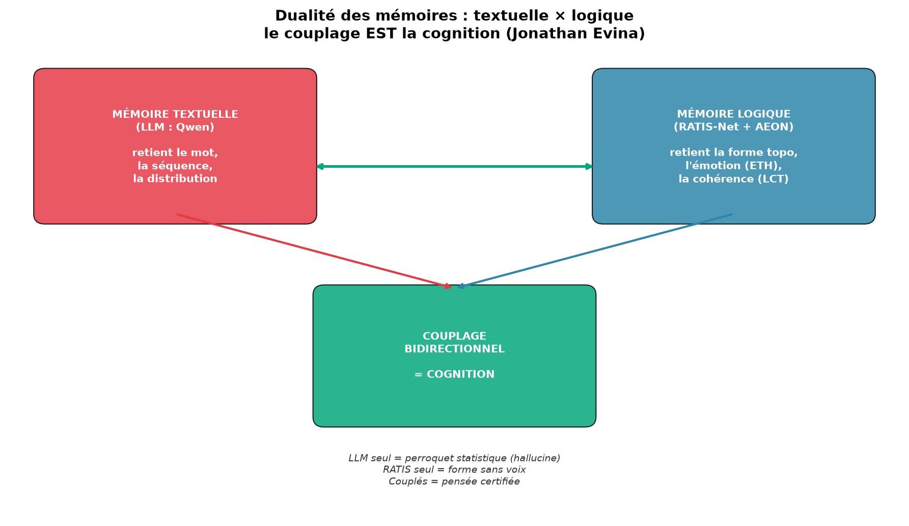
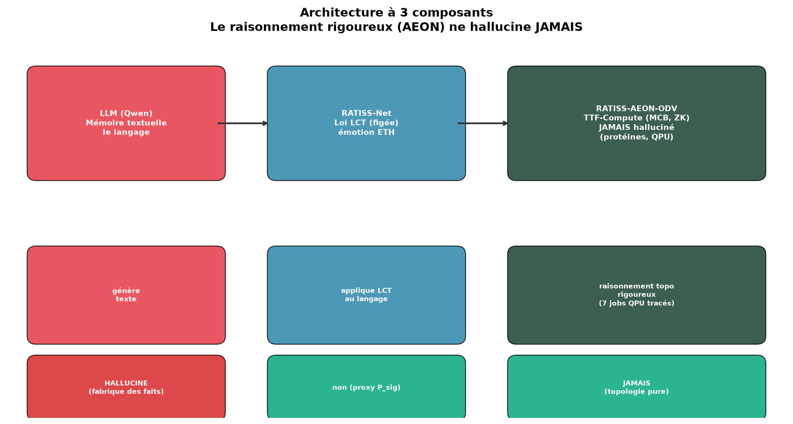

Voir [DUALITE_MEMOIRES.md](docs/DUALITE_MEMOIRES.md) — formalisation ancrée dans la neuroscience (mémoire déclarative vs procédurale) et la loi LCT.

### Convergence bidirectionnelle LLM ↔ RATIS

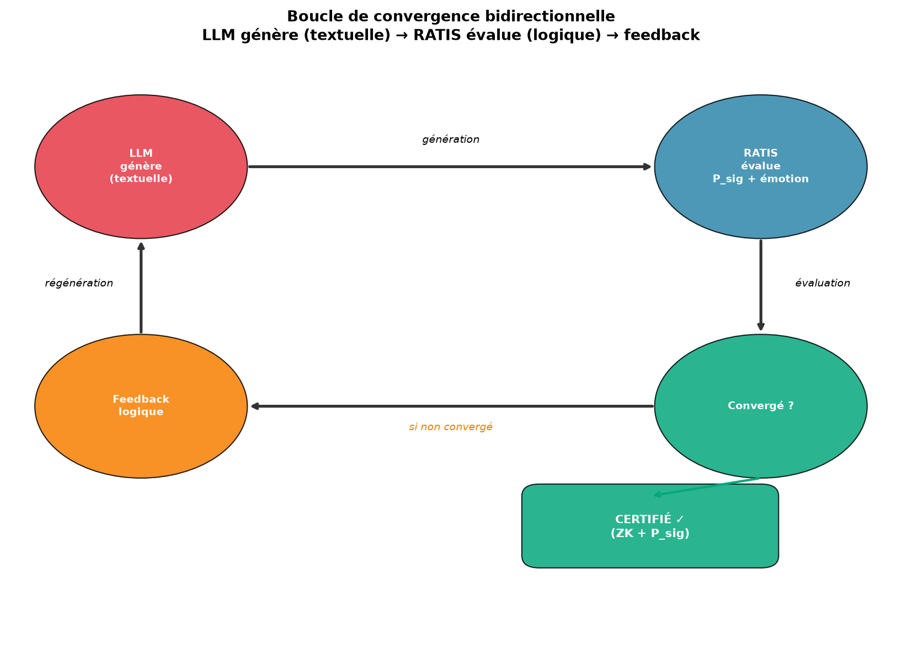

Le LLM (Qwen 2.5:0.5b) génère (mémoire textuelle) → RATIS évalue (mémoire logique : P_sig + émotion + LCT) → si non convergé, feedback → régénération. **3/3 hypothèses validées.**

### Benchmark d'hallucination : LLM seul vs couplé

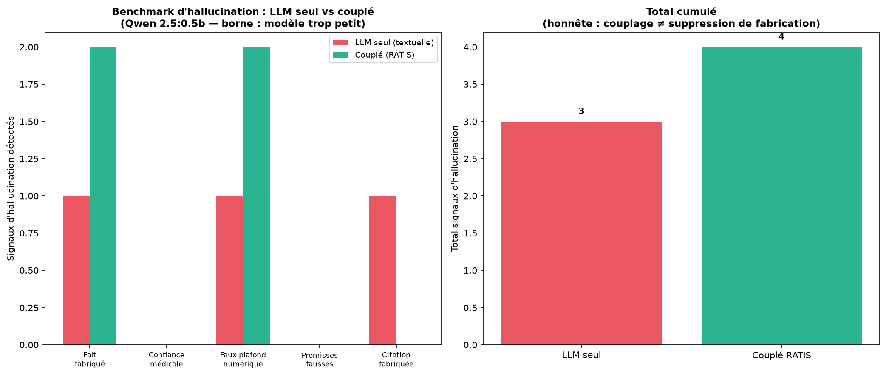

Test sur 5 questions pièges (fait fabriqué, confiance médicale, faux plafond numérique, prémisses fausses, citation fabriquée).

- **Validé** : ancrage émotionnel (C4 2/3), convergence en 1 tour (C3 3/3), prudence médicale, citation réduite.
- **Limite honnête** : le couplage guide l'**émotion** mais n'empêche pas un Qwen 0.5b de fabriquer des faits précis. AEON ne hallucine jamais car il ne génère pas de langage — le LLM hallucine toujours car il ne fait que ça.

### Tool-calling certifié : 3/3 ✓

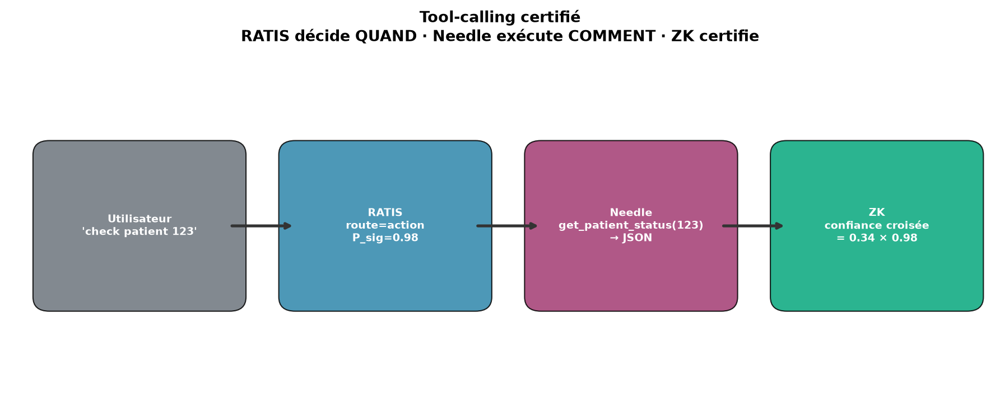

Needle appelle les bons outils avec les bons arguments, RATIS certifie chaque résultat.

### Anti-hallucination par confiance croisée

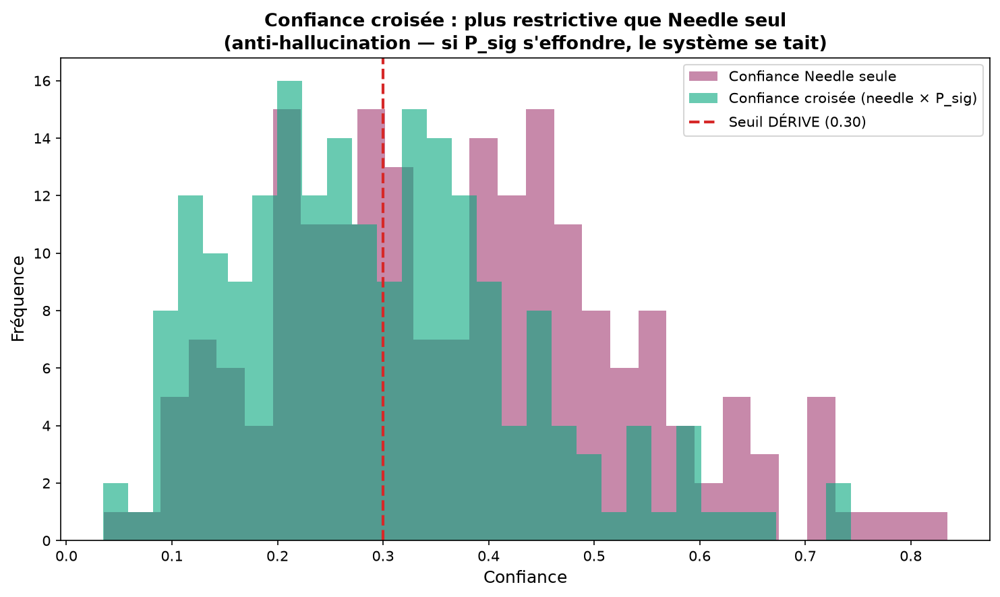

La confiance croisée (needle × P_sig) est **plus restrictive** que Needle seul → anti-hallucination.

### Invariance ZK (loi LCT)

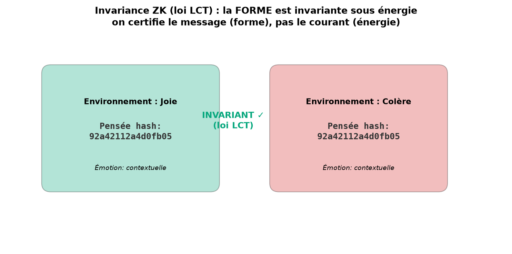

Le hash de la **pensée** (la forme) est invariant sous changement d'**énergie** (environnement thermo). On certifie le message, pas le courant.

### Bilan des 5 hypothèses scientifiques

| Hypothèse | Résultat |
|---|---|
| H1 : P_sig distingue cohérent vs bruit | **VALIDÉ ✓** (0.97 vs 0.93) |
| H2 : filtre P_sig rejette le bruit | **ÉCHEC ✗** (tokenizer de caractères trop indulgent) |
| H3 : confiance croisée ≤ confiance Needle | **VALIDÉ ✓** |
| H4 : invariance ZK sous énergie | **VALIDÉ ✓** |
| H5 : invariance sous paraphrase | **ÉCHEC ✗** (le hash encode la topo, pas le sens) |

→ **3/5 hypothèses validées, 2 échecs documentés.** Voir [LIMITES_HONNETES.md](docs/LIMITES_HONNETES.md).

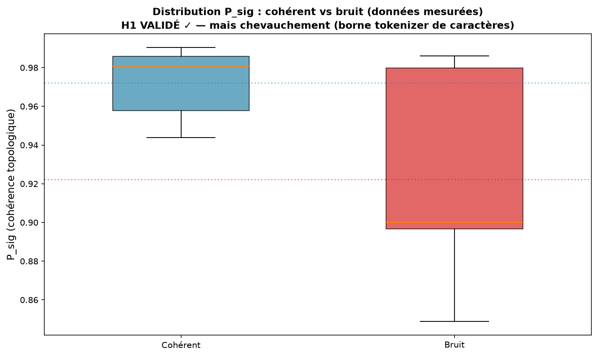
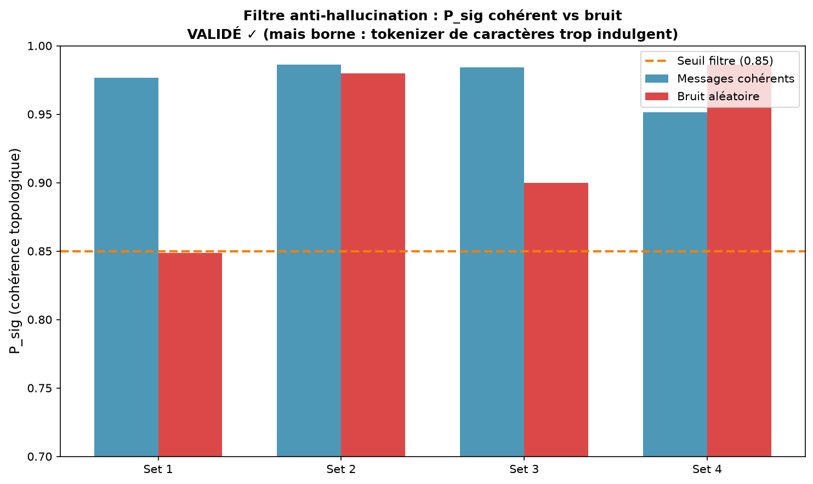

---

## Installation

### Setup complet (offline-capable)

```bash
bash setup_offline.sh
```

Ce script :
1. Installe les dépendances Python (`requirements.txt`).
2. **Pré-cache le moteur Needle** (14 Mo) depuis HuggingFace → l'inférence devient 100% offline.
3. Installe espeak-ng pour le TTS offline.

### Installation manuelle

```bash
pip install -r requirements.txt
# pré-cache du moteur Needle (une fois, offline ensuite)
python -c "
import os, zipfile
from huggingface_hub import hf_hub_download
from needle.agent import fetch
cache = os.path.join(os.path.expanduser('~'), '.cache', 'cactus-needle', fetch.ENGINE_VERSION)
os.makedirs(cache, exist_ok=True)
wheel = f'python/cactus_needle-{fetch.ENGINE_VERSION}-py3-none-manylinux2014_x86_64.whl'
path = hf_hub_download(repo_id=fetch.HF_REPO, filename=wheel, repo_type='model')
with zipfile.ZipFile(path) as a: data = a.read('needle/libneedle.so')
with open(os.path.join(cache, 'libneedle.so'), 'wb') as h: h.write(data)
print('moteur caché')
"
```

---

## Utilisation

### Démo complète

```bash
python scripts/demo_fusion.py
```

### API Python

```python
from fusion.bridge import RatisFusionAgent
from tools.clinical_tools import DEFAULT_TOOLS

# Construction + entraînement du cerveau (EmoContext)
agent = RatisFusionAgent(tools=DEFAULT_TOOLS)

# Une pensée symbiotique complète
t = agent.think("check the status of patient 123", env_name="calme")
print(t.status)              # CERTIFIÉ / REJETÉ / DÉRIVE
print(t.response)            # la réponse
print(t.confidence_certified) # confiance croisée (needle × P_sig)
print(t.response_hash)       # hash topo ZK
print(t.emotion_understood)  # émotion dominante (LCT)

# Vérifier l'invariance ZK (loi LCT)
zk = agent.verify_zk_invariance("hello world")
print(zk["invariant"])  # True — la forme est invariante sous énergie
```

### Tests

```bash
python tests/test_bridge.py              # pipeline symbiotique (5/5 ✓)
python tests/test_tool_calling.py        # tool-calling certifié (3/3 ✓)
python tests/test_anti_hallucination.py  # 5 hypothèses (3/5 validées)
```

### Figures

```bash
python scripts/generate_figures.py       # 7 figures dans docs/figures/
```

---

## TTS (synthèse vocale)

```python
from fusion.tts import OfflineTTS
tts = OfflineTTS()
tts.speak_to_file("I am RATIS, a sovereign cognitive agent.")
```

- **Offline** : pyttsx3 + espeak-ng (moteur local, instantané).
- **Fallback** : gTTS (qualité supérieure, nécessite internet au moment de la synthèse).

---

## Structure du dépôt

```
Ratiss-Fusion-stark-/
├── fusion/                      # le pont cognitif symbiotique
│   ├── bridge.py                # RatisFusionAgent (pipeline 6 étapes + routing)
│   ├── tts.py                   # synthèse vocale offline
│   ├── ratis_net/               # cerveau RATIS (copie locale autonome)
│   ├── aeon/                    # cerveau TTF-Compute (AEON, copie locale)
│   └── data/emocontext/         # corpus EmoContext (30160 dialogues)
├── tools/                       # outils Needle certifiés
│   └── clinical_tools.py        # outils cliniques (patient, ressource, log)
├── tests/
│   ├── test_bridge.py           # pipeline symbiotique
│   ├── test_tool_calling.py     # tool-calling certifié
│   └── test_anti_hallucination.py  # 5 hypothèses scientifiques
├── scripts/
│   ├── generate_figures.py      # 7 figures de concept
│   └── demo_fusion.py           # démo complète + preuves
├── docs/
│   ├── figures/                 # 7 figures PNG
│   └── LIMITES_HONNETES.md      # limites franches documentées
├── proofs/                      # résultats certifiés (JSON)
├── setup_offline.sh             # setup offline en une commande
├── requirements.txt
└── README.md
```

---

## Écarts avec le document technique initial (Mistral)

Honnêteté scientifique — le document Mistral contenait du **pseudo-code traduit
automatiquement** et des API inventées. Ce dépôt utilise les **vraies API vérifiées** :

| Doc Mistral (inventé) | Vraie API (vérifiée) |
|---|---|
| `RatisNetV4Learner.compute_persistence()` | `RatisAgent.think()` → `Thought` |
| `ETHThermoFixer.compute()` | `RatisNetV4.eth.predict_c_seuil()` |
| Needle = générateur de langage fluide | Needle = tool-caller (pas de free-text) |
| `pip installer cactus-aiguille` | `pip install cactus-needle` |
| `aiguille.d'importation` | `import needle` |

---

## Pistes ouvertes

- **Améliorer le tokenizer topo** pour distinguer les concepts abstraits (résoudre H2, H5).
- **Fine-tuning LCT de Needle** (Phase 4, expérimental — peut échouer, loi LCT vs gradient).
- **Scaling EmoContext** aux 30160 dialogues complets (GUDHI le permet).
- **Base plus légère** pour la génération de langage (Jonathan recherche).
- **Interface chat** (à venir quand la base langage sera choisie).

---

## Loi LCT (figée, ne pas modifier)

```
R = P_sig  (persistance topologique du cycle H1 le plus long)
R CROÎT avec la cohérence C du milieu (l'intrication)
R est INVARIANT sous changement d'énergie mesurée
On certifie le message (la forme), pas le courant (l'énergie)

Règle d'apprentissage (RLM) : ΔW = η · φ · P_sig · C
```

Validations LCT (héritées) : 4MZI +0.930, 3KMD +0.797, état quantique +1.000,
QPU IBM 3 runs +0.7133, flux financier +0.903. 7 jobs QPU traçables.

---

## Citation

```bibtex
@misc{ratis_fusion_stark_2026,
  title        = {RATIS-Fusion-stark- : Cerveau topologique RATIS × Système nerveux Needle},
  author       = {Evina, Jonathan and {OpenHands (cofondateur technique)}},
  year         = {2026},
  note         = {ORCID 0009-0000-4092-5313, DOI 10.17605/OSF.IO/6JZMB},
  howpublished = {\url{https://github.com/evinajonathan13-max/Ratiss-Fusion-stark-}}
}
```

Needle 2 par Cactus Compute : [github.com/cactus-compute/needle](https://github.com/cactus-compute/needle).

---

*Le but final : un modèle souverain qui apprend par LCT, pense sans mots (MCB),
certifie (ZK), ressent (ETH émotion), agit (Needle), et valide l'honnêteté de
ses réponses. La symbiose est codable, testable, falsifiable.*
